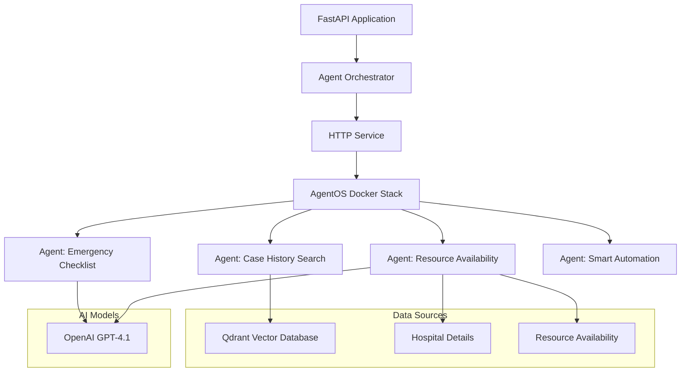
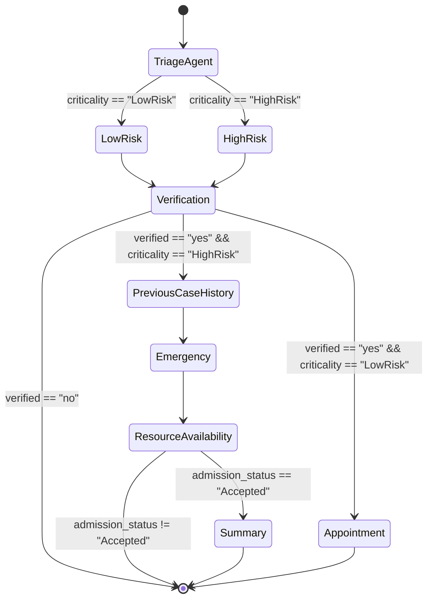

# Medical Agent Automation System
This is a forked project from the Genai.works [Agentos](https://github.com/genai-works-org/genai-agentos)

A sophisticated multi-agent system designed to automate and enhance emergency medical workflows using AI agents, vector databases, and large language models.

## Project Overview

This system leverages a custom agent orchestration framework to automate medical decision-making processes, including:

- Patient case history retrieval
- Emergency treatment checklist generation
- Hospital resource allocation
- Patient transfer recommendations

The system uses a vector database (Qdrant) to store and retrieve similar medical cases, and integrates with OpenAI's GPT-4.1 model to generate structured medical recommendations.

## System Architecture



## Smart Automation Workflow



### Smart Automation Process Flow

1. **Triage Assessment**: Patient case is evaluated to determine risk level (High or Low)
2. **Verification**: Ensures all required information is present in the case sheet
3. **Appointment Creation**: For low-risk cases, creates a doctor appointment
4. **Case History Search**: For high-risk cases, retrieves relevant historical cases for reference
5. **Emergency Action List**: Generates recommended clinical actions based on case details
6. **Resource Availability Check**: Determines if hospital resources can accommodate the patient
7. **Summary Generation**: Creates a comprehensive clinical handover summary for accepted patients

## Workflow

1. **Initialization**: The FastAPI application starts and initializes the agent orchestrator
2. **Agent Registration**: The orchestrator registers all agents with AgentOS through the HTTP Service
3. **Agent Triggering**: AgentOS triggers the agents when needed
4. **Smart Automation**: Agent orchestrates the workflow for processing patient cases:
   - Triage Assessment: Evaluates patient case to determine risk level
   - Verification: Ensures all required information is present
   - Appointment Creation: For low-risk cases, creates a doctor appointment
   - Case History Search: For high-risk cases, Agent C searches the vector database for similar medical cases
   - Emergency Checklist Generation: Agent generates a structured emergency treatment checklist
   - Resource Allocation: Agent checks hospital resource availability and makes transfer recommendations
   - Summary Generation: Creates a comprehensive clinical handover summary for accepted patients

## Agent Descriptions

### Agent: Case History Search
Searches the Qdrant vector database for similar patient cases based on a query. Returns structured patient information including history, treatment, medications, allergies, vitals, and recommendations.

### Agent: Emergency Checklist
Generates comprehensive emergency treatment notes with sections for presenting complaint, assessment, interventions, checklist of actions, clinical notes, and disposition. Uses OpenAI's GPT-4.1 model.

### Agent: Resource Availability
Checks hospital resource availability and provides transfer recommendations. Reads hospital details and resource availability from JSON files and assesses whether the current hospital can accommodate the patient based on clinical needs and available resources.

### Agent: Smart Automation
Provides smart assistance for user cases by orchestrating a workflow that includes triage assessment, verification, case history search, emergency action list generation, resource availability check, and summary generation. Uses a state graph to manage the flow of information between different components.

## Documentation
* You can find the documentation in Notion AI : [Notion.ai](https://denim-cayenne-e7a.notion.site/Documentation-Outline-230757bb4ab58058a503fbe30911f43c)
* You can see the slide deck in [Gamma.app](https://gamma.app/docs/Multi-Agent-System-for-Hospital-Management-lg58btvrzi1iskg)

## Video Link
* You can find the video in this [youtube channel](https://youtu.be/LpdgPOHv_4M)

## Services

### Qdrant Vector Database
Stores and retrieves medical case data using vector embeddings. Configured for optimal performance with specific parameters for cosine similarity search.

### HTTP Service
Handles agent registration, login, and communication with the AgentOS Docker Stack.

### AgentOS Docker Stack
A separate Docker stack that manages agent triggering and communication. Agents are registered with AgentOS through the HTTP Service, and AgentOS triggers the agents when needed.

## Data Sources

### Hospital Details
JSON file containing information about hospitals, including specialties, beds, equipment, and staff.

### Resource Availability
JSON file containing information about current hospital resource availability.

## Installation and Usage

1. Clone the repository: https://github.com/genai-works-org/genai-agentos/blob/main/README.md
2. Follow the instructions within the file to setup the AgentOS stack
3. Ensure the docker container of Genai-agent os is running.
1. Now Clone this repository [link](https://github.com/gh-aswanth/healthcare_assistant_with_agentos)
2. Install dependencies:
   ```
   pip install -r requirements.txt
   ```
3. Set up environment variables:
   ```
   export OPENAI_API_KEY=your_api_key
   export USERNAME=your_username
   export PASSWORD=your_password
   ```
4. Run the application:
   ```
   python -m src.main
   ```

## API Endpoints

- `/health`: Health check endpoint
- `/search`: Similarity search endpoint for retrieving similar medical cases

## Features

- **Automated login into GenAI Agent OS Interface with custom Backend server using FastApi
- **Multi-agent orchestration**: Coordinated system of specialized agents
- **Vector similarity search**: Efficient retrieval of similar medical cases
- **AI-powered medical recommendations**: Generation of structured emergency treatment notes
- **Resource allocation optimization**: Intelligent hospital resource management
- **Automated transfer recommendations**: Data-driven patient transfer decisions

## Technologies Used

- Agentos
- FastAPI
- Qdrant Vector Database
- OpenAI GPT-4.1
- LangChain
- GenAI Session Framework
- Async Python
  
