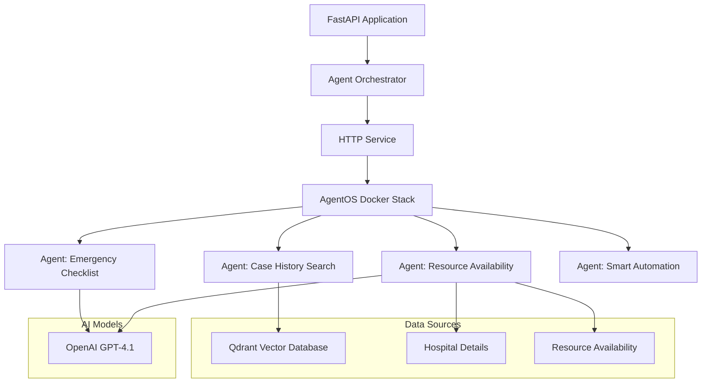
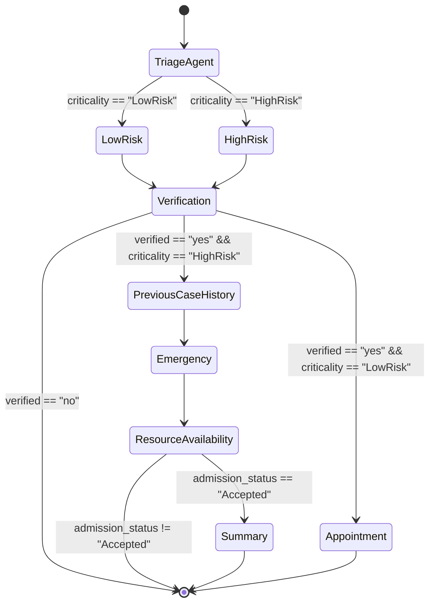

# Medical Agent Automation System
> 🧠**Brains Behind:** Engineered by a group of AI Enthusiasts 
 
This project is developed as part of a **Hackathon Challenge** organized by the **GenAI Works community** . 

A sophisticated **Multi-agent system** designed to automate and enhance emergency medical workflows using AI agents, vector databases, and large language models.

GenAI Works provides a robust infrastructure with seamless experience for building, configuring, and deploying intelligent agents using modern LLMs. With features like secure key management, agent-level JWT authentication, a full-featured frontend UI, **AgentOS** makes it incredibly easy to go from idea to working prototype.
 
> 🔄 **Note:** This implementation is a **forked version** of the official [genai-agentos repository](https://github.com/genai-works-org/genai-agentos.git). The codebase has been adapted to address the specific requirements of structured email generation.
 
🧩 GitHub Repository: [genai-agentos](https://github.com/genai-works-org/genai-agentos.git)  

🌐 Community: [GenAI Works](https://https://genai.works/)

## Problem statement
Modern hospitals 🏨 struggle with fragmented systems and outdated processes that hinder patient flow, scheduling, and resource coordination. These inefficiencies create bottlenecks at every stage of the patient journey, from triage to discharge. As a result, critical treatments are delayed, patient satisfaction declines, and operational costs rise. Ultimately, this strains healthcare staff and leads to underutilization of valuable hospital resources, compromising the quality of care.
 
## Project Overview

This Agentic system leverages a custom agent orchestration framework to automate medical decision-making processes, including:

- Patient case history retrieval
- Emergency treatment checklist generation
- Hospital resource allocation
- Patient transfer recommendations

The system uses a vector database (Qdrant) to store and retrieve similar medical cases, and integrates with OpenAI's GPT-4.1 model to generate structured medical recommendations.

## System Architecture



## 🩺 Smart Automation Workflow – Functional Overview 🚑


This workflow automates patient triage by intelligently assessing risk, verifying details, checking medical history, and managing hospital resources.

#### 🏁 Start with TriageAgent:

> The patient’s case is evaluated for criticality, classifying it as either LowRisk or HighRisk.

#### 🔍 Verification:

> Ensures patient information is accurate and determines whether to proceed with advanced checks.

#### ⚠️ High-Risk Cases:

> * If verified and marked HighRisk, the system queries previous case history to gather essential medical context.
> * It then triggers emergency protocols and checks resource availability (beds, specialists, equipment).
> * If resources are available (admission_status == "Accepted"), the system generates a case summary for hospital staff.
> * If not accepted, it exits or redirects appropriately.
> * 
#### 🗓 Low-Risk Cases:

> If verified and marked LowRisk, it directly schedules an appointment for follow-up care.

#### 🚫 Unverified Cases:

> If verification fails, the workflow safely terminates, preventing incorrect admissions.

## ✨ Highlights

1. **Initialization**: The FastAPI application starts and initializes the agent orchestrator
2. **Agent Registration**: The orchestrator registers all agents with AgentOS through the HTTP Service
3. **Agent Triggering**: AgentOS triggers the agents when needed
4. **Smart Automation**: Agent orchestrates the workflow for processing patient cases:
   - **Triage Assessment**: Evaluates patient case to determine risk level
   - **Verification**: Ensures all required information is present in the case sheet
   - **Appointment Creation**: For low-risk cases, creates a doctor appointment
   - **Case History Search**: For high-risk cases, Agent C searches the vector database for similar medical cases
   - **Emergency Checklist Generation**: Agent generates recommended clinical actions based on case details
   - **Resource Availability Check**: Agent checks hospital resource availability and makes transfer recommendations
   - **Summary Generation**: Creates a comprehensive clinical handover summary for accepted patients

## 🤖 Agent Descriptions

#### ⚙️ Agent: Case History Search
Searches the Qdrant vector database for similar patient cases based on a query. Returns structured patient information including history, treatment, medications, allergies, vitals, and recommendations.

#### ⚙️ Agent: Emergency Checklist
Generates comprehensive emergency treatment notes with sections for presenting complaint, assessment, interventions, checklist of actions, clinical notes, and disposition. Uses OpenAI's GPT-4.1 model.

#### ⚙️ Agent: Resource Availability
Checks hospital resource availability and provides transfer recommendations. Reads hospital details and resource availability from JSON files and assesses whether the current hospital can accommodate the patient based on clinical needs and available resources.

#### ⚙️ Agent: Smart Automation
Provides smart assistance for user cases by orchestrating a workflow that includes triage assessment, verification, case history search, emergency action list generation, resource availability check, and summary generation. Uses a state graph to manage the flow of information between different components.

## 📝 Documentation
* You can find the documentation in Notion AI : [Notion.ai](https://denim-cayenne-e7a.notion.site/Documentation-Outline-230757bb4ab58058a503fbe30911f43c)
* You can see the slide deck in [Gamma.app](https://gamma.app/docs/Multi-Agent-System-for-Hospital-Management-lg58btvrzi1iskg)

## 🎥 Video Link
* You can find the video in this [youtube channel](https://youtu.be/LpdgPOHv_4M)

## Services

### Qdrant Vector Database
Stores and retrieves medical case data using vector embeddings. Configured for optimal performance with specific parameters for cosine similarity search.

### HTTP Service
Handles agent registration, login, and communication with the AgentOS Docker Stack.

### AgentOS Docker Stack
A separate Docker stack that manages agent triggering and communication. Agents are registered with AgentOS through the HTTP Service, and AgentOS triggers the agents when needed.

## Data Sources

### Hospital Details
JSON file containing information about hospitals, including specialties, beds, equipment, and staff.

### Resource Availability
JSON file containing information about current hospital resource availability.

## ⚙️ Prerequisites
 
Ensure the following tools are available on your machine:
 
- **Git**
- **Python 3.10+**
- **[uv](https://github.com/astral-sh/uv)** (recommended Python package manager)
- **Docker Desktop**
- **OpenAI API Key**
 
> If `uv` is not installed, you can use `pip` as an alternative.
 
## 🚀 Getting Started
Follow these steps to set up and run the Email Drafting Agent.
 
 
### 🧪 1. Clone the Agent OS Repository
 
```bash
git clone https://github.com/genai-works-org/genai-agentos.git
cd genai-agentos/
```
### 🔐 2. Configure Environment
 
Create your `.env` file for AgentOS configuration:
 
```bash
cp .env-example .env
```
- This `.env` file can be empty at first.
- All variables in `.env-example` are commented — uncomment and edit as needed.
- Example settings include ports, model defaults, and OpenAI keys.

### 🐳 3. Start Docker & Infrastructure
 
Make sure **Docker Desktop** is running.
 
Start infrastructure:
 
```bash
make up
# or alternatively
docker-compose up
```
 
Once started, access the platform at:
 
- **Frontend UI:** [http://localhost:3000](http://localhost:3000)
- **Swagger API Docs:** [http://localhost:8000/docs/](http://localhost:8000/docs/)
 
### 🧪 4. Finally Clone our **MAS hospital management** Repository
 
```bash
git clone https://github.com/gh-aswanth/healthcare_assistant_with_agentos
```
### ⚙️ 5. Create virtual environment and Install dependencies

```bash
# Install dependencies
uv sync

### 🚀 6. Run the Agent
 
Go to the src directory:
 
```bash
cd src\
uv run main.py
```
> 🔄 *Important Note:* Our **Intelligent Orchestrator system** which is built with FastApi Server can automate the signup and login process of a user by our default credentials or users can provide their credentials in our backend script (if they needed unique login)

Once running, the agent will be visible and interactable in your **Frontend UI → Chat Section**.


## API Endpoints

- `/health`: Health check endpoint
- `/search`: Similarity search endpoint for retrieving similar medical cases

## Features

- **Automated login into GenAI Agent OS Interface with custom Backend server using FastApi
- **Multi-agent orchestration**: Coordinated system of specialized agents
- **Vector similarity search**: Efficient retrieval of similar medical cases
- **AI-powered medical recommendations**: Generation of structured emergency treatment notes
- **Resource allocation optimization**: Intelligent hospital resource management
- **Automated transfer recommendations**: Data-driven patient transfer decisions

## Technologies Used

- Agentos
- FastAPI
- Qdrant Vector Database
- OpenAI GPT-4.1
- LangChain
- GenAI Session Framework
- Async Python
  
